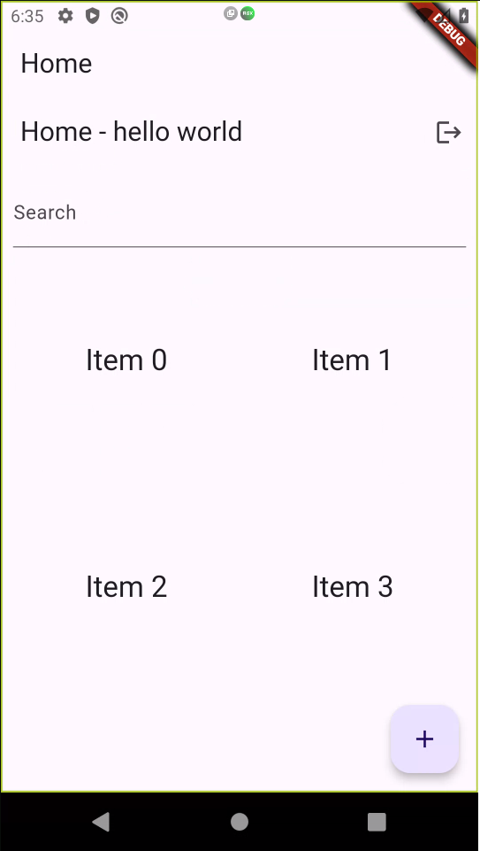
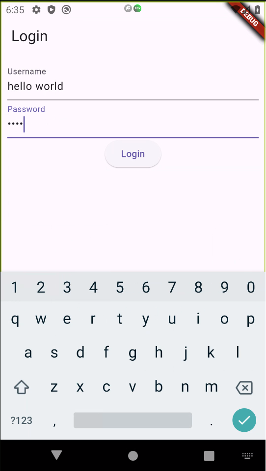
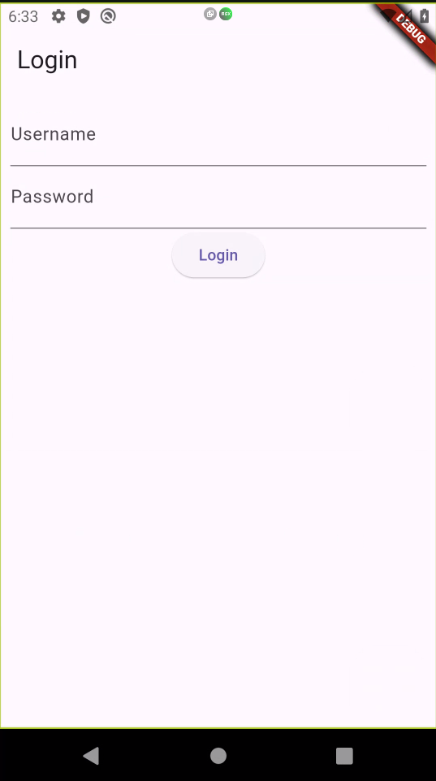

# Flutter Writing App Prototype

This is a Flutter prototype for a mobile writing app, allowing users to create and edit text content on their devices. It serves as the final project for my Basic Flutter Certification obtained through Dicoding. While it includes a login page, note that user authentication is not implemented in this prototype. This is intended as a mockup/prototype to showcase the core writing functionality.

**Screenshots**

* **Homepage:**


  


* **Login Screen with Input:**


  


* **Login Page:**


  

  

**Features:**

- Create and edit text documents(in progress)
- Display a home screen with username greetings
- Implement basic search functionality (placeholder for future enhancements)
- Responsive layout that adapts to different screen sizes

**Getting Started**

**Prerequisites:**

- Flutter development environment set up ([https://docs.flutter.dev/get-started/install](https://docs.flutter.dev/get-started/install))

**Running the App:**

1. Clone the repository:
   ```bash
   git clone https://github.com/mcpe500/note-writing-app.git   ```

2. Navigate to the project directory:

   ```bash
   cd note-writing-app/myapp
   ```

3. Install dependencies:

   ```bash
   flutter pub get
   ```

4. Run the app:

   ```bash
   flutter run
   ```

**Usage**

**Prototype Usage:**

1. Launch the app.
2. You'll be greeted by the login page (non-functional in this prototype).
3. Navigate to the home screen (username will be blank).
4. Use the search bar to experiment with the search functionality (placeholder).
5. Explore the layout and responsiveness of the app on different screen sizes.

**Contributing**

We welcome your interest in this project! While this is currently a solo project, feel free to reach out if you have any suggestions or questions.

**License**

This project is licensed under the [MIT License](LICENSE).

**Additional Considerations:**

- **Screenshots:** Include screenshots to visually represent the app's interface (optional).
- **Future Enhancements:** Briefly mention planned features for future development (optional).
- **Code Quality:** Maintain well-commented, formatted code for readability and maintainability.
- **Testing:** Consider adding unit and integration tests for robust functionality (optional).

**Developed using:**

- idx.dev (optional, if applicable)